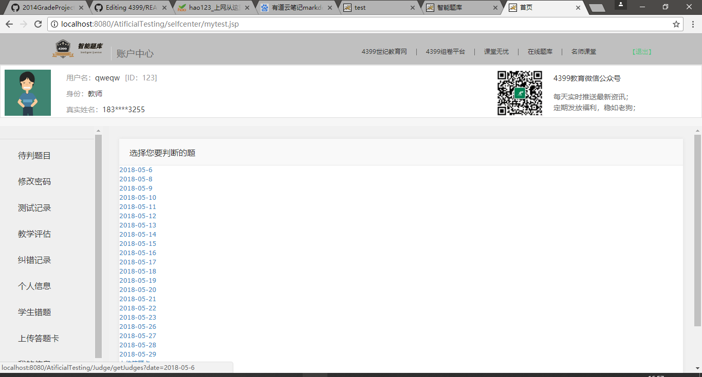
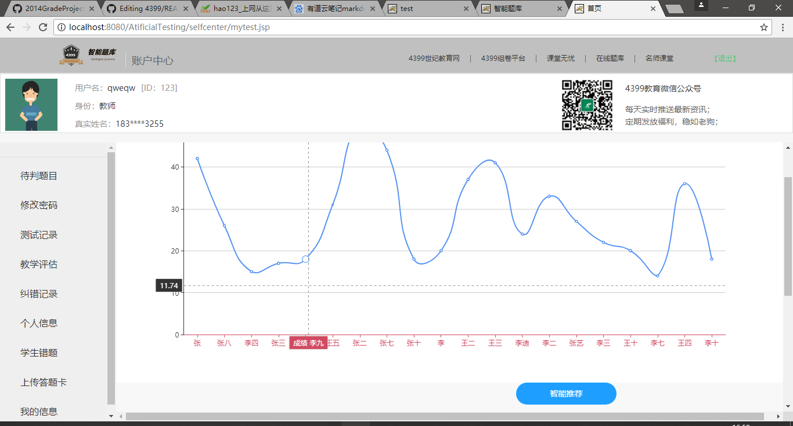
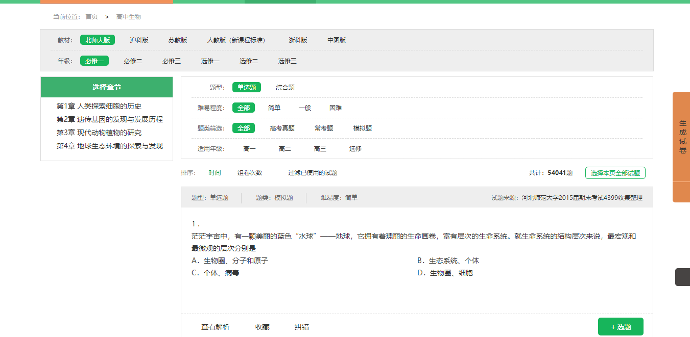
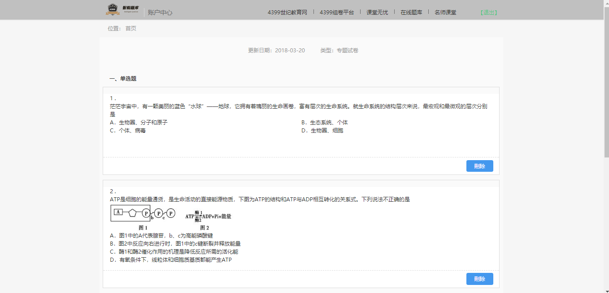

# 4399
## 项目简介 
智能题库是为了方便老师组卷判卷，并且提供了题目智能推荐功能的一个在线系统。

* 孟喆（项目经理）
  * GitHub：[https://github.com/9512mzr](https://github.com/9512mzr)
* 肖舒翔：
  * GitHub：[https://github.com/xiao970205](https://github.com/xiao970205)
* 宋泽坤:
  * GitHub：[https://github.com/songzkuser](https://github.com/songzkuser)
* 陈冲：
  * GitHub：[https://github.com/cchenchong](https://github.com/cchenchong)
* 李坤：
  * GitHub：[https://github.com/hisuperdou ](https://github.com/hisuperdou )
* 田瑞康：
  * GitHub：[https://github.com/666Kang](https://github.com/666Kang)
 * 田赛：
    * GitHub：[https://github.com/425503141](https://github.com/425503141 )

运行效果
---------------------------

登录界面

主界面

个人中心界面

待判题界面

数据展示界面

题库界面

生成试卷界面

